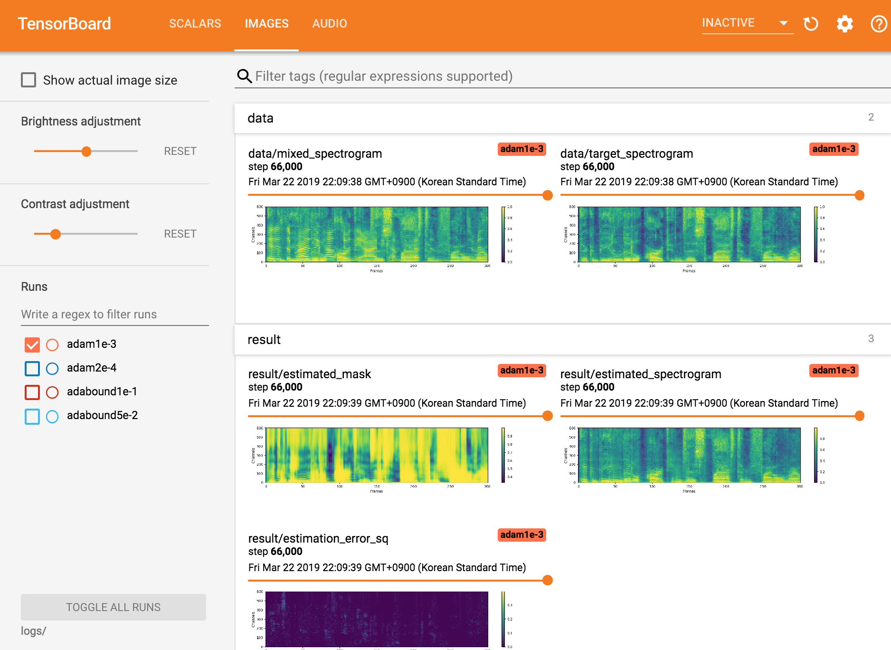

# Infocom2021
Flowchartof the AI network.

v3


## Schedule

| Period | chenning | hanqing |
| ------ | ------ | ------ |
| 0701-0703 | Power loss[x]| Reproduction [x]|
| 0704-0704 |       |Code Review [x], dataset Production|

# VoiceFilter

Unofficial PyTorch implementation of Google AI's:
[VoiceFilter: Targeted Voice Separation by Speaker-Conditioned Spectrogram Masking](https://arxiv.org/abs/1810.04826).


## Dependencies

1. Python and packages

    This code was tested on Python 3.6 with PyTorch 1.0.1.
    Other packages can be installed by:

    ```bash
    pip install -r requirements.txt
    ```

1. Miscellaneous

    [ffmpeg-normalize](https://github.com/slhck/ffmpeg-normalize) is used for resampling and normalizing wav files.
    See README.md of [ffmpeg-normalize](https://github.com/slhck/ffmpeg-normalize/blob/master/README.md) for installation.

## Prepare Dataset

1. Download LibriSpeech dataset

    To replicate VoiceFilter paper, get LibriSpeech dataset at http://www.openslr.org/12/.
    `train-clear-100.tar.gz`(6.3G) contains speech of 252 speakers, and `train-clear-360.tar.gz`(23G) contains 922 speakers.
    You may use either, but the more speakers you have in dataset, the more better VoiceFilter will be.

1. Resample & Normalize wav files

    First, unzip `tar.gz` file to desired folder:
    ```bash
    tar -xvzf train-clear-360.tar.gz
    ```

    Next, copy `utils/normalize-resample.sh` to root directory of unzipped data folder. Then:
    ```bash
    vim normalize-resample.sh # set "N" as your CPU core number.
    chmod a+x normalize-resample.sh
    ./normalize-resample.sh # this may take long
    ```

1. Edit `config.yaml`

    ```bash
    cd config
    cp default.yaml config.yaml
    vim config.yaml
    ```
#### Tips:

change train_dir and test_dir. Maintain different config.yaml at desktop and server.

1. Preprocess wav files

    In order to boost training speed, perform STFT for each files before training by:
    ```bash
    python generator.py -c [config yaml] -d [data directory] -o [output directory] -p [processes to run]
    ```
    This will create 100,000(train) + 1000(test) data. (About 160G)

#### Tips:

1. Run `v0 => generator.py` can get `mixed_mag`, `mixed_wav`, `target_mag`, `target_wav`, `d_vector.txt`. Note this `d_vector.txt` is the path of reference audio.

2. Run `v1.0` or `v2.0` `generator.py` can also get `mixed_phase` and `target_phase`.

3. On server side, DO NOT use -p as multi-processor.

## Train VoiceFilter

1. Run

    After specifying `train_dir`, `test_dir` at `config.yaml`, run:
    ```bash
    python trainer.py -c [config yaml] -e [path of embedder pt file] -m [name] -g 1
    ```
    This will create `chkpt/name` and `logs/name` at base directory(`-b` option, `.` in default)

#### Tips:

add `-g` to choose cuda device, default is device 1.

1. View tensorboardX

    ```bash
    tensorboard --logdir ./logs
    ```

    

1. Resuming from checkpoint

    ```bash
    python trainer.py -c [config yaml] --checkpoint_path [chkpt/name/chkpt_{step}.pt] -e [path of embedder pt file] -m name
    ```

## Evaluate

```bash
python inference.py -c [config yaml] -e [path of embedder pt file] --checkpoint_path [path of chkpt pt file] -m [path of mixed wav file] -r [path of reference wav file] -o [output directory]
```

## Possible improvments

- Try power-law compressed reconstruction error as loss function, instead of MSE. (See [#14](https://github.com/mindslab-ai/voicefilter/issues/14))

## Author

[Seungwon Park](http://swpark.me) at MINDsLab (yyyyy@snu.ac.kr, swpark@mindslab.ai)

## License

Apache License 2.0

This repository contains codes adapted/copied from the followings:
- [utils/adabound.py](./utils/adabound.py) from https://github.com/Luolc/AdaBound (Apache License 2.0)
- [utils/audio.py](./utils/audio.py) from https://github.com/keithito/tacotron (MIT License)
- [utils/hparams.py](./utils/hparams.py) from https://github.com/HarryVolek/PyTorch_Speaker_Verification (No License specified)
- [utils/normalize-resample.sh](./utils/normalize-resample.sh.) from https://unix.stackexchange.com/a/216475
